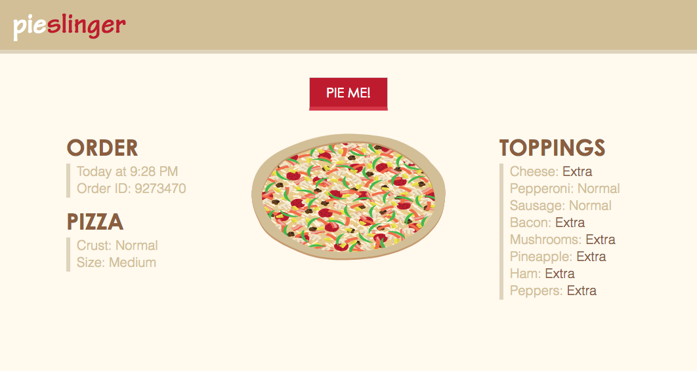

## Pie Slinger

Pie Slinger is an app designed to display random pizza order data along with some visuals.  I designed it as if it were an order taken in by a pizza delivery company.  So it is divided into Order, Pizza, and Toppings categories, where amounts or sizes that are not normal are highlighted to make them obvious.  Then I included an illustration of a pizza that displays what the pizza should look like when finished.

The app is built in React and is tested in Jest/Enzyme.
Pizza drawings are svgs built in layers in Adobe Illustrator.

To run test suite, clone down the repo and run:

npm install
npm test

